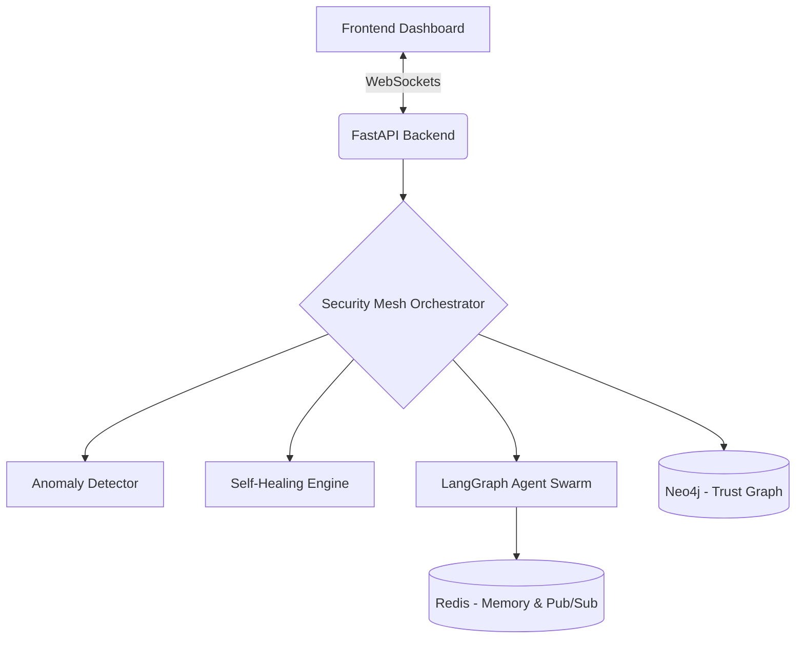

# AgentOps Security Mesh 🛡️

**AgentOps Security Mesh** (Mesh Guard) is an AI Security Operating System designed to secure, monitor, and heal multi-agent AI swarms in real-time. It acts as an overarching security supervisor that detects anomalies, prevents adversarial attacks, and automatically recovers compromised agents without human intervention.

## 🌟 Key Features

*   **Real-time Threat Detection:** Continuous monitoring of agent memory, prompt payloads, and tool execution to catch prompt injections, memory poisoning, and identity spoofing.
*   **Dynamic Trust Graph (Neo4j):** Visual and programmatic mapping of agent-to-agent interactions, tracking permission edges and dynamic trust scores based on behavioral heuristics.
*   **Self-Healing Engine:** An autonomous 8-step recovery protocol (Pause → Snapshot → Analyze → Spawn → Restore → Replay → Verify → Report) that isolates compromised agents and transparently replaces them.
*   **Red-Team Attack Simulator:** Built-in attack vectors to simulate zero-day exploits, memory overrides, and tool hijacking against the swarm to validate defenses.
*   **Live Dashboard:** A beautiful, dark-themed React/D3 frontend for real-time visibility into the mesh network via WebSockets.

## 🏗️ Architecture

The system is built on a high-performance, asynchronous tech stack:

1.  **Frontend (UI/UX):** React, Vite, Tailwind CSS, Zustand (state management), and D3.js (interactive force-directed trust graph).
2.  **Backend (API & Orchestration):** FastAPI (Python), LangGraph (agent orchestration), and WebSockets for real-time telemetry.
3.  **Data & State:**
    *   **Neo4j:** Stores the static and dynamic relationships between agents (Trust Topology).
    *   **Redis:** High-throughput Pub/Sub for routing security events, handling memory snapshots, and broadcasting websocket payloads.



## 🚀 Getting Started

### Prerequisites

*   Python 3.10+
*   Node.js 18+
*   Neo4j (Running locally or via Docker)
*   Redis (Running locally or via Docker)

### 1. Setup Services (Docker)

```bash
# Start Redis
docker run -d --name redis-mesh -p 6379:6379 redis:alpine

# Start Neo4j
docker run -d --name neo4j-mesh -p 7474:7474 -p 7687:7687 -e NEO4J_AUTH=neo4j/password neo4j:latest
```

### 2. Backend Setup

```bash
cd backend
python -m venv venv
source venv/bin/activate  # On Windows: venv\Scripts\activate
pip install -r requirements.txt

# Start the FastAPI server
python -m uvicorn app.main:app --reload
```

### 3. Frontend Setup

```bash
cd frontend
npm install

# Start the Vite dev server
npm run dev
```

### 4. Usage

1.  Open your browser to `http://localhost:5173`.
2.  The backend will automatically bootstrap a set of default agents (Planner, Executors, Validators).
3.  Navigate to the **Attack Simulator** tab to launch payloads against the swarm.
4.  Watch the **Self-Healing Engine** detect the anomalies, suspend the affected agents, and spawn clean replacements.
5.  View the real-time topology updates in the **Trust Graph**.

## 🛡️ The 8-Step Self-Healing Protocol

When the Anomaly Detector flags an agent with a critical Z-score deviation, the Self-Healing Engine takes over:

1.  **PAUSE**: Suspend the compromised agent's execution immediately (tracked in Neo4j).
2.  **SNAPSHOT**: Capture the current corrupted memory state for forensic analysis.
3.  **ANALYZE**: Determine the last known good memory snapshot from Redis.
4.  **SPAWN**: Provision a new, clean agent with an inherited cautious trust score.
5.  **RESTORE**: Load the safe memory snapshot into the new agent's context.
6.  **REPLAY**: Fast-forward safe pending transactions via LangGraph edges.
7.  **VERIFY**: Check integrity against active validation nodes.
8.  **REPORT**: Broadcast the recovery success via WebSockets to update the dashboard.

---
*AgentOps Security Mesh — Securing the Swarm*
